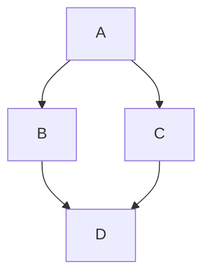
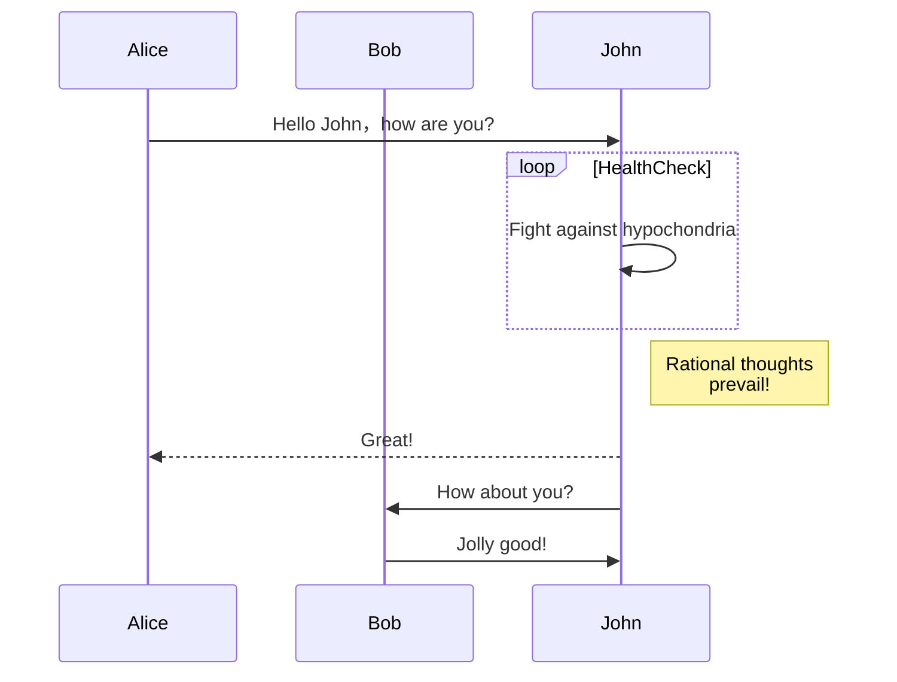
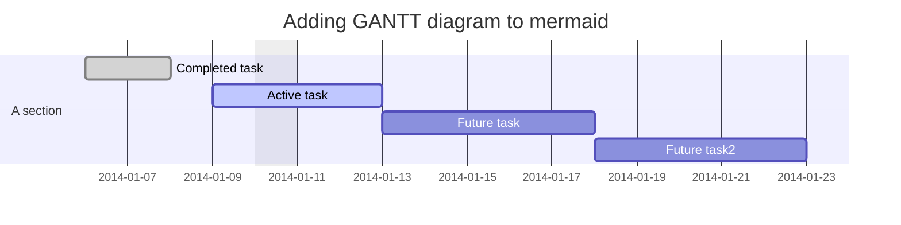
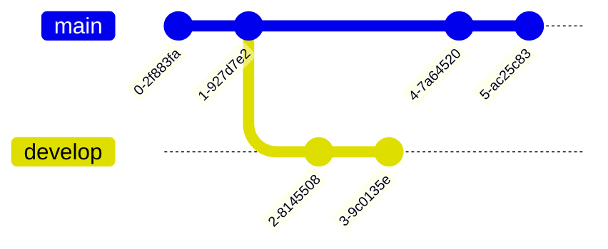

> Mermaid是一个基于JavaScript的图标绘制工具，它允许用户通过类似Markdown的简单文本语法来创建和修改各种图标，它的主要目的是帮助开发者快速创建易于修改的图标，使文档能够与开发进度保持同步。

##### 1.Flowchart[流程图]

##### 2.Sequence diagram[时序图]

- participant：参与者

##### 3.Grantt diagram[甘特图]

##### 4.Git graph[Git图谱]

